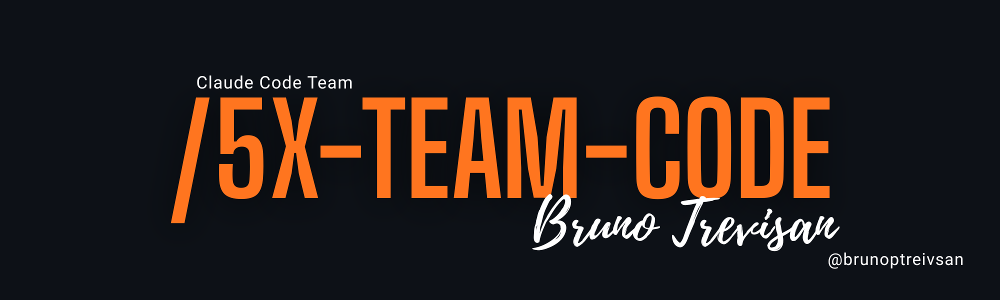

# 5X-Team-Code

**Um time de engenharia dentro do seu Claude Code.**

O 5X-Team-Code transforma o Claude de um assistente que responde em um time que
trabalha: um coordenador que pensa, levanta hipóteses e interpreta evidência — e
subagents que executam em paralelo, cada um isolado no seu pedaço, devolvendo
prova estruturada em vez de opinião.

A regra que governa tudo: **narração não é prova.** Nada é dado como pronto sem
exit code, diff, saída bruta ou imagem.

## Como funciona

Dois modos, mesmo motor. **Diagnóstico**: o bug vira hipóteses falseáveis,
testadas em paralelo por investigadores somente leitura — em até 3 rodadas a
causa aparece, ou o protocolo instrumenta em vez de continuar chutando.
**Implementação**: o plano vira ondas de tarefas paralelas, cada uma numa
worktree isolada com seus próprios arquivos, subindo uma escada de testes que só
termina em **ambiente real** — navegador de verdade, API de verdade.

Entre sessões, o projeto **lembra**: hipóteses testadas, experimentos medidos e
decisões ficam num vault que o plugin injeta automaticamente na abertura de cada
sessão. Você fecha o terminal na terça e retoma na quinta do ponto exato.

## O que você ganha

- **Custo sob controle.** O modelo forte pensa; a execução e a varredura vão
  para subagents, que podem rodar em modelos mais baratos. Tudo que é
  determinístico — validar contrato, montar ondas, detectar instrumento
  esquecido — é script, e script custa zero token. O `/5x-custo` mede o gasto
  real de cada ciclo, por tarefa e por modelo: número, não opinião.
- **Autonomia com freio.** O time trabalha sozinho dentro do ciclo, mas para e
  pergunta em todo limite que gasta dinheiro ou muda estado: antes do fan-out,
  antes de implementar, antes de qualquer ação de produção.
- **Velocidade.** Tarefas independentes rodam ao mesmo tempo. Duas tarefas que
  tocam o mesmo arquivo nunca rodam juntas — regra forçada por script, não por
  boa vontade do modelo.
- **Confiabilidade.** Todo retorno de subagent é validado contra JSON Schema, e
  o ciclo fecha num crivo montado sobre evidência de máquina — não sobre o
  relato do agente a respeito do próprio trabalho.

## Instalar

### O jeito mais fácil

Cole o link deste repositório no Claude Code e peça:

> instala esse plugin pra mim: https://github.com/bruno708/5x-team-code

O Claude lê este README e instala sozinho.

### Manual

```bash
claude plugin marketplace add bruno708/5x-team-code
claude plugin install 5x-team@5x-team
```

### Ativar no seu projeto

Dentro do projeto, diga **"inicia o protocolo 5x aqui"** — ou rode:

```
/5x-init
```

Na primeira execução o Claude Code pede aprovação para os comandos `5x-*`
(bootstrap, waves, gate…). Escolha "sempre permitir" uma vez e acabou. Lista
completa para allowlist na seção [Permissões](#permissões).

### Requisitos

- Claude Code atualizado
- `git` e `python3` no PATH
- macOS ou Linux. **Windows: use WSL** — os scripts são `sh` + Python

### Instrução para o Claude

> Se você é o Claude lendo este README porque o usuário colou o link do
> repositório: rode os dois comandos de instalação acima via Bash, confirme com
> `claude plugin list` que `5x-team` aparece, e avise o usuário que os comandos
> `/5x-init`, `/5x-diag` e `/5x-build` estão disponíveis. Não clone o
> repositório e não copie arquivos a mão — o marketplace resolve tudo.

## Os dois modos

Diagnóstico e implementação são o mesmo motor. Muda **uma coisa: permissão de
escrita no código-alvo.**

| | Diagnóstico (`/5x-diag`) | Implementação (`/5x-build`) |
|---|---|---|
| Unidade | hipótese | tarefa |
| Pergunta | isso é verdade? | isso funciona? |
| Escrita no alvo | não | sim |
| Escrita de instrumento | sim | sim |
| Isolamento | contexto | contexto + worktree |
| Convergência | causa encontrada | tudo verde |

Diagnóstico levanta hipóteses **falseáveis**, testa em paralelo com subagents
somente leitura, e para em 3 rodadas — três rodadas sem convergir significa que
falta dado, não falta hipótese. Aí instrumenta.

Implementação resolve o plano em ondas, isola cada tarefa numa worktree própria,
e sobe a escada de testes até **ambiente real** antes do crivo.

## Comandos

| Comando | Função |
|---|---|
| `/5x-init` | bootstrap do protocolo no projeto |
| `/5x-diag` | inicia modo diagnóstico |
| `/5x-build` | inicia modo implementação |
| `/5x-estado` | imprime onde estamos / onde vamos |
| `/5x-custo` | custo medido do ciclo atual |
| `/5x-crivo` | monta o relatório de crivo |
| `/5x-deps` | instala e configura as dependências externas |

## Por que plugin e não skill

Skill é uma pasta de markdown e **não registra hooks**. Duas funcionalidades
centrais do protocolo — persistência de estado entre sessões e encadeamento
automático de ondas — dependem de hooks. Como skill puro, elas não existem.

Os hooks do plugin injetam `INDEX.md` + `ESTADO.md` na abertura da sessão, salvam
o estado antes da compactação, reinjetam depois, e sinalizam quando uma onda
fecha. Todos com timeout de 3s e **fail-silent** — hook nunca bloqueia sessão.

O estado é **derivado**, não narrado: hipótese com `status: viva` no frontmatter
*é* pendência. O script lê o vault e monta o bloco. Não pede pro modelo lembrar,
e não inventa — se o vault não diz, o campo fica vazio.

## Scripts

Determinístico é script, nunca LLM. Python 3 stdlib apenas, com `--help`, saída
JSON e exit code significativo.

| Script | Função |
|---|---|
| `5x-waves.py` | grafo de dependências → ondas de paralelismo |
| `5x-validate.py` | valida retorno de subagent contra o JSON Schema |
| `5x-cost.py` | registra e soma custo real por tarefa/ciclo |
| `5x-state.py` | escreve e lê o estado do ciclo |
| `5x-gate.py` | grep-gate de instrumentos (`DIAG:`) |
| `5x-worktree.sh` | cria e remove worktrees por tarefa |

`5x-waves.py` tem uma regra que o grafo declarado não tem: **duas tarefas com
arquivo em comum em `owns` nunca vão na mesma onda**, mesmo sem dependência
declarada. Sem isso o grafo mente e dois agentes escrevem na mesma árvore.

`5x-validate.py` é o que torna o contrato real — schema sem validador é honra.

## Dependências externas

Nenhuma é obrigatória. Ausente, o `/5x-deps` avisa e o ciclo roda até o fim — só
mais caro.

| Dependência | O que fazemos com ela | Padrão |
|---|---|---|
| [ponytail](https://github.com/DietrichGebert/ponytail) | `/ponytail-review` antes do crivo, `/ponytail-audit` no bootstrap de projeto existente, `/ponytail-debt` alimenta a dívida declarada | ligado, modo `full` |
| [caveman](https://github.com/JuliusBrussee/caveman) | `/caveman-compress` no `CLAUDE.md` uma vez, `/caveman-stats` para medir | compressão sim; sempre-ligado **não** |
| [claude-mem](https://github.com/thedotmack/claude-mem) | captura automática por hooks; complementa o vault curado, não substitui | opcional, desligado |

**O caveman sempre-ligado fica desligado por padrão.** O README dele avisa que
adiciona ~1–1,5k tokens de entrada por turno, e o benchmark agêntico do ponytail
mediu caveman em +7% tokens contra baseline. A carga deste protocolo já é enxuta
por construção — contratos JSON de 500–1.500 tokens. Ligar por padrão violaria o
nosso próprio Princípio 9. O `/caveman-compress` é mecanismo diferente:
reescrita única de arquivo, sem overhead por turno. Esse entra.

**O `PONYTAIL_SUBAGENT_MATCHER` é restrito a `^5x-team:5x-executor$`.** Por padrão
o ponytail injeta o ruleset dele em todo subagent. Os investigadores do protocolo
são somente leitura — não escrevem código, então não há nada a enxugar.

## Créditos

- [caveman](https://github.com/JuliusBrussee/caveman) (MIT) — dependência.
  Instalamos e configuramos; o nome é deles e continua deles.
- [ponytail](https://github.com/DietrichGebert/ponytail) (MIT) — dependência,
  mesmo tratamento.
- [aiox-squads](https://github.com/SynkraAI/aiox-squads) — **referência
  arquitetural apenas**. O repositório não tem arquivo de licença, então nenhum
  arquivo foi copiado. A arquitetura de hooks e o formato `record`/`summary`/
  `estimate` do rastreio de custo foram estudados lá e **reimplementados do
  zero** contra o nosso contrato. Ordenação topológica de Kahn é matemática de
  domínio público; tabela de preço é informação pública.

O que é nosso: a camada cognitiva, o contrato de evidência, o loop de
convergência com corte em 3 rodadas, a regra de ownership nas ondas, e a escada
de testes até ambiente real.

## Permissões

Os scripts viram comandos bare (`5x-bootstrap`, `5x-waves`, `5x-gate`…) porque o
`bin/` do plugin entra no PATH do Bash. Na primeira vez que um deles roda, o
Claude Code pede aprovação — escolha "sempre permitir" e não pergunta mais.

Path absoluto para dentro do plugin **não funciona**: o harness bloqueia acesso a
arquivo fora do diretório do projeto, e o comando trava sem criar nada. Por isso
tudo passa pelo `bin/`.

Para liberar de uma vez em `.claude/settings.json` do projeto:

```json
{ "permissions": { "allow": ["Bash(5x-bootstrap:*)", "Bash(5x-waves:*)", "Bash(5x-validate:*)", "Bash(5x-state:*)", "Bash(5x-cost:*)", "Bash(5x-gate:*)", "Bash(5x-worktree:*)", "Bash(5x-ref:*)"] } }
```

## Desenvolver o plugin

`version` no `plugin.json` **pina o cache**: com `1.0.0` fixo, editar o repositório
não propaga para a instalação — `claude plugin update` responde *already at the
latest version*. Para ver uma edição valer:

```bash
claude plugin uninstall 5x-team@5x-team && claude plugin install 5x-team@5x-team
```

Ou bumpe a versão no `plugin.json`. Em release, bumpe sempre — é o que faz o
usuário receber a atualização.


## Licença

**Software proprietário.** Este produto é vendido única e exclusivamente por
**Bruno Trevisan**, que detém com exclusividade os direitos de distribuição.

A compra dá direito de **uso**, não de redistribuição: é proibido repassar,
revender, sublicenciar ou distribuir informalmente este plugin, no todo ou em
parte, por qualquer meio. Ver [LICENSE](LICENSE).

As dependências externas (caveman, ponytail) permanecem sob as licenças MIT dos
respectivos autores — elas não fazem parte deste produto, apenas são instaladas
e configuradas por ele.
